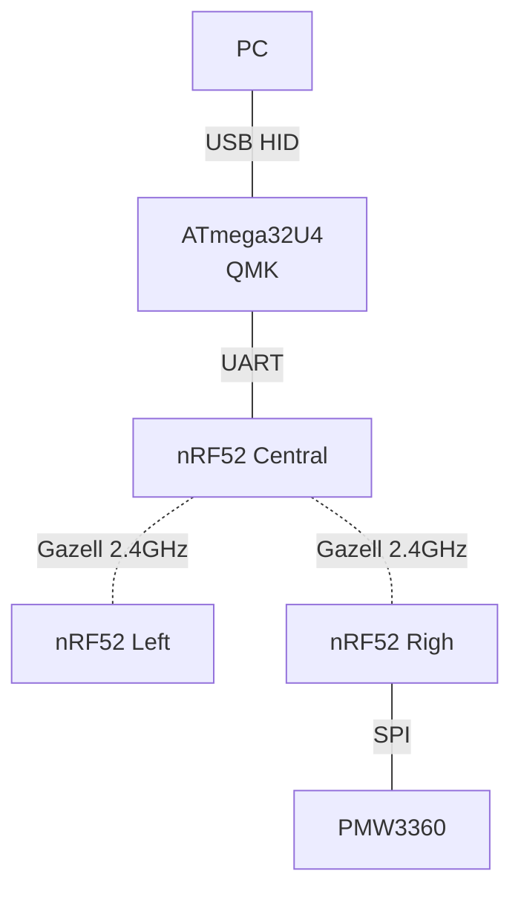

# ErgoSNM nRF Firmware

[ErgoSNM Rev 3.x](https://github.com/siderakb/ergo-snm-keyboard)  wireless keyboard nRF firmware, based on nRF52840 SoC and [NCS](https://www.nordicsemi.com/Products/Development-software/nrf-connect-sdk).

- [`mitosis-like/`](/mitosis-like/): Main firmware

- [`three-mod/`](/three-mod/): Experimental firmware
